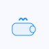
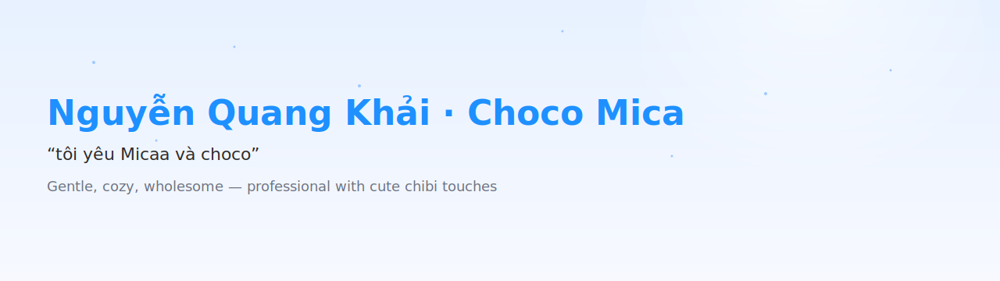

  <!-- Hero: Mahiru coffee chibi (swap to .gif when ready) -->
  

  

  <!-- Banner: layered gradient (Mahiru blue–white × Kurumi red–gold × Nino pink–purple). Use PNG when ready: assets/profile-banner.png -->
  

  
  
  
  

  

## About · Skills · Learning

<table>
  <tr>
    <td width="110" align="center">
      <!-- Use PNG avatar when available: assets/profile-avatar.png -->
      
      
“tôi yêu Micaa và choco”

    </td>
    <td>
      <strong>About Me 🌸</strong>
       
      I’m Nguyễn Quang Khải (aka <em>Choco Mica</em>), a Computer Engineering student at HUST. I enjoy building clean, user‑friendly tools and learning systems. I love blue–white aesthetics, gentle vibes, and chibi art.
        
      <strong>Currently Learning ✨</strong>
      <ul>
        <li>Systems and backend foundations</li>
        <li>Algorithms and data structures practice</li>
        <li>Modern TypeScript tooling and testing</li>
      </ul>
      <strong>Goals 🌙</strong>
      <ul>
        <li>Build reliable, well‑tested backend services</li>
        <li>Document learning clearly and share concise notes</li>
        <li>Balance performance with readability</li>
      </ul>
    </td>
  </tr>
</table>

## Skills

| Category | Tools |
|---|---|
| Languages |     |
| Frameworks |    |
| Tools |       |

### Currently Learning

- Systems and backend foundations
- Algorithms and data structures practice
- Modern TypeScript tooling and testing

### Goals

- Build reliable, well-tested backend services with clean tooling
- Document learning clearly and share concise notes
- Keep performance in mind without sacrificing readability

  

## Projects 💜

<table>
  <tr>
    <td>
      <strong>MerkleKV ✨</strong> 
      <a href="https://github.com/NQKhaixyz/MerkleKV">Verifiable KV store w/ Merkle proofs</a> 
      
    </td>
    <td>
      <strong>cozy-systems-lab 🌙</strong> 
      <a href="https://github.com/NQKhaixyz/cozy-systems-lab">OS/network/perf notes & experiments</a> 
       
    </td>
  </tr>
  <tr>
    <td>
      <strong>mica-toolkit 🐣</strong> 
      <a href="https://github.com/NQKhaixyz/mica-toolkit">Tiny TypeScript/Node CLIs</a> 
       
    </td>
    <td>
      <strong>blue-backend-starter ⭐</strong> 
      <a href="https://github.com/NQKhaixyz/blue-backend-starter">Express starter · lint · tests · Docker</a> 
       
    </td>
  </tr>
  <tr>
    <td>
      <strong>chibi-algos 📘</strong> 
      <a href="https://github.com/NQKhaixyz/chibi-algos">Neat algo solutions</a> 
       
    </td>
    <td>
      <strong>gentle-notes 🍫</strong> 
      <a href="https://github.com/NQKhaixyz/gentle-notes">Blue–white learning wiki</a> 
      
    </td>
  </tr>
  </table>

  

## Stats ✨

  
  
  
    
  

  Bonus: soft blue/purple contribution snake below.

  <!-- Palette customized via query params -->
  

  

## Gallery 🌸

  <!-- Swap these to .gif when available (keep filenames; change extension) -->
  
  
  
  

  

## Waifu Inspiration · Quote of the Day 🌙

  

## Fun Facts

- Mahiru: I keep layouts gentle and tidy for calm focus.
- Kurumi: I love subtle night-sky accents and elegant details.
- Nino: I enjoy bold, modern touches and playful energy.

  

## Contact & Socials 💌

- Facebook: <a href="https://www.facebook.com/NQKhai2k6" rel="me">facebook.com/NQKhai2k6</a>
- Email: <em>your.email@domain.com</em> (replace with your contact)
- If you like blue–white calm vibes and tidy code, say hi.

---

  
   
  <em>“tôi yêu Micaa và choco”</em>
  
✦

